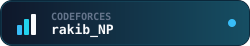
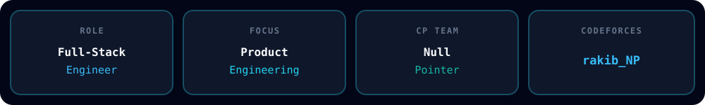
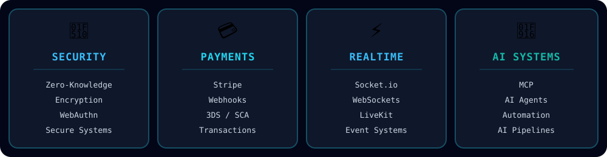
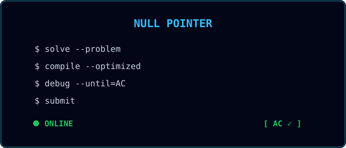
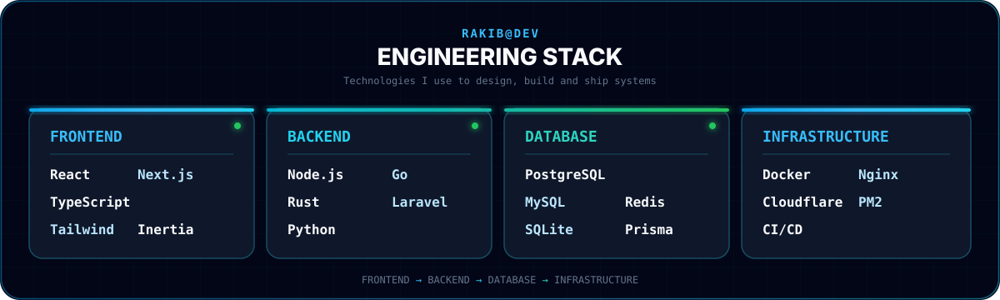
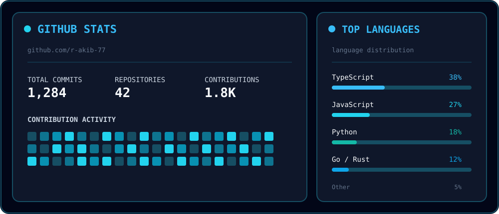
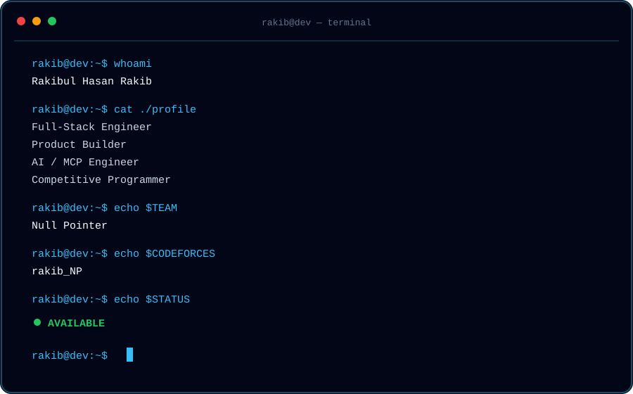

 

  

  

&nbsp;&nbsp;
&nbsp;&nbsp;

---

## `01 / ABOUT`

 

<table width="90%">
<tr>
<td align="center">

### Full-Stack Engineer · Product Builder

I turn ideas into production-ready products across **web, backend, AI, payments, realtime systems, security, and infrastructure**.

</td>
</tr>
</table>

 

 

---

## `02 / WHAT I BUILD`

## `03 / FEATURED SYSTEMS`

<table width="100%">
<thead>
<tr>
<th align="center">PROJECT</th>
<th align="left">DESCRIPTION</th>
<th align="center">STACK</th>
</tr>
</thead>

<tbody>

<tr>
<td align="center">
<a href="https://github.com/britsync07-prog/ahs-app">
<b>🔐 AHS Vault</b>
</a>
</td>

<td>
Zero-knowledge biometric vault with encrypted storage and secure device pairing.
</td>

<td align="center">
<code>Go</code>
<code>Rust</code>
<code>Tauri</code>
<code>React</code>
<code>Kotlin</code>
</td>
</tr>

<tr>
<td align="center">
<a href="https://github.com/britsync07-prog/crm">
<b>📊 BritCRM</b>
</a>
</td>

<td>
Self-hosted CRM with realtime communication, billing, meetings and MCP.
</td>

<td align="center">
<code>Next.js</code>
<code>Prisma</code>
<code>PostgreSQL</code>
<code>LiveKit</code>
</td>
</tr>

<tr>
<td align="center">
<a href="https://github.com/britsync07-prog/stripepay">
<b>💳 BlackDesck</b>
</a>
</td>

<td>
Consultation platform with Stripe Connect payouts and 3DS checkout.
</td>

<td align="center">
<code>Laravel</code>
<code>React</code>
<code>Stripe</code>
</td>
</tr>

<tr>
<td align="center">
<a href="https://github.com/britsync07-prog/britTrade">
<b>📈 BritTrade AI</b>
</a>
</td>

<td>
Crypto signal engine with automated execution and paper/live parity.
</td>

<td align="center">
<code>Node.js</code>
<code>CCXT</code>
<code>Kotlin</code>
</td>
</tr>

<tr>
<td align="center">
<a href="https://github.com/britsync07-prog/BritTube">
<b>🎬 BritTube</b>
</a>
</td>

<td>
AI video generation pipeline with public API and MCP server.
</td>

<td align="center">
<code>FastAPI</code>
<code>Next.js</code>
<code>MoviePy</code>
</td>
</tr>

<tr>
<td align="center">
<a href="https://github.com/britsync07-prog/mailsender">
<b>✉️ MailSender</b>
</a>
</td>

<td>
Multi-tenant email infrastructure with SMTP, DKIM/SPF and warmup.
</td>

<td align="center">
<code>TypeScript</code>
<code>PostgreSQL</code>
<code>Redis</code>
</td>
</tr>

<tr>
<td align="center">
<a href="https://github.com/britsync07-prog/testingit">
<b>🎯 LeadHunter</b>
</a>
</td>

<td>
B2B lead-generation platform with scraping, newsletters and tracking.
</td>

<td align="center">
<code>Puppeteer</code>
<code>SQLite</code>
<code>Stripe</code>
</td>
</tr>

</tbody>
</table>

---

## `04 / TEAM`

 

### 👑 Team Leader — `Null Pointer`

  

  

## `05 / TECH STACK`

 

  

## `06 / ENGINEERING LOOP`

 

  

## `07 / GITHUB ACTIVITY`

  

 

## `08 / CONTACT`

 

  

<table width="90%"> <tr> <td align="center">

</td> </tr> </table>  

  

  

