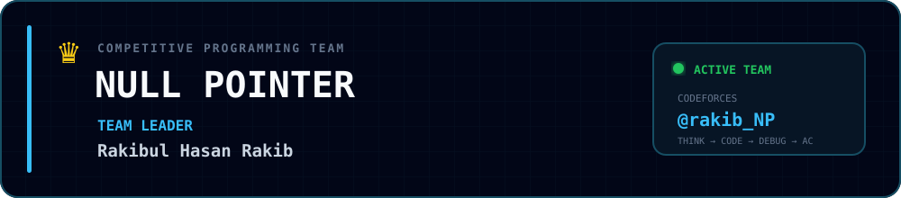

 
 

 
 

---

## `01 / ABOUT`

 

 

 

---

## `02 / WHAT I BUILD`

 

---

## `03 / FEATURED SYSTEMS`

<table width="100%">
<tr>

<td width="50%" valign="top">

### 🔐 AHS Vault

Zero-knowledge biometric vault with encrypted storage and secure device pairing.

**Stack:**  
`Go` `Rust` `Tauri` `React` `Kotlin`

 

<a href="https://github.com/britsync07-prog/ahs-app">
  View Repository →
</a>

</td>

<td width="50%" valign="top">

### 📊 BritCRM

Self-hosted CRM with realtime communication, billing, meetings and MCP.

**Stack:**  
`Next.js` `Prisma` `PostgreSQL` `LiveKit`

 

<a href="https://github.com/britsync07-prog/crm">
  View Repository →
</a>

</td>

</tr>

<tr>

<td width="50%" valign="top">

### 💳 BlackDesck

Consultation platform with Stripe Connect payouts and 3DS checkout.

**Stack:**  
`Laravel` `React` `Stripe`

 

<a href="https://github.com/britsync07-prog/stripepay">
  View Repository →
</a>

</td>

<td width="50%" valign="top">

### 📈 BritTrade AI

Crypto signal engine with automated execution and paper/live parity.

**Stack:**  
`Node.js` `CCXT` `Kotlin`

 

<a href="https://github.com/britsync07-prog/britTrade">
  View Repository →
</a>

</td>

</tr>

<tr>

<td width="50%" valign="top">

### 🎬 BritTube

AI video generation pipeline with public API and MCP server.

**Stack:**  
`FastAPI` `Next.js` `MoviePy`

 

<a href="https://github.com/britsync07-prog/BritTube">
  View Repository →
</a>

</td>

<td width="50%" valign="top">

### ✉️ MailSender

Multi-tenant email infrastructure with SMTP, DKIM/SPF and warmup.

**Stack:**  
`TypeScript` `PostgreSQL` `Redis`

 

<a href="https://github.com/britsync07-prog/mailsender">
  View Repository →
</a>

</td>

</tr>

<tr>

<td width="50%" valign="top">

### 🎯 LeadHunter

B2B lead-generation platform with scraping, newsletters and tracking.

**Stack:**  
`Puppeteer` `SQLite` `Stripe`

 

<a href="https://github.com/britsync07-prog/testingit">
  View Repository →
</a>

</td>

<td width="50%" valign="top">

### ⚡ More Systems

Building and experimenting with **AI automation, MCP servers, SaaS products, developer tooling, and infrastructure**.

 

`AI` `MCP` `SaaS` `Automation`

</td>

</tr>
</table>

---

## `04 / TEAM`

 

 
 

 
 

---

## `05 / TECH STACK`

 

 
 

---

## `06 / ENGINEERING LOOP`

 

 
 

---

## `07 / GITHUB ACTIVITY`

 

 
 

---

## `08 / CONTACT`

 

 
 

 
 

 

