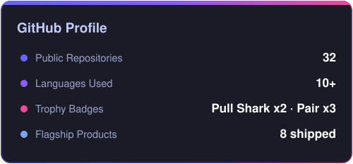
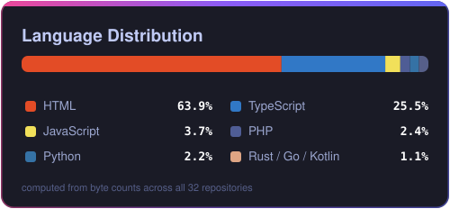

<div align="center">

# `> Musfiqur Rahman Saimon`

### Full-Stack Product Engineer · Systems Builder · AI Infrastructure

**I don't just write code — I design, build, deploy, and maintain complete products.**

<br/>

[](https://github.com/britsync07-prog)
[](mailto:saimon@ascentraconsulting.co.uk)
[](#)

</div>

---

## `$ whoami`

I'm a **Full-Stack Product Engineer** focused on turning complex ideas into production systems.

My work sits at the intersection of:

```text
Product
   ↓
Architecture
   ↓
Engineering
   ↓
Infrastructure
   ↓
Automation
   ↓
Production
```

I enjoy building systems where the difficult parts actually matter:

- 🔐 Security & encrypted storage
- 💳 Payments & financial workflows
- ⚡ Realtime systems
- 🤖 AI agents & MCP
- 📧 Email infrastructure
- 📊 CRM & business platforms
- 🖥️ Desktop applications
- 🚀 Deployment & production infrastructure

> **Philosophy:** Build it → break it → understand it → fix it → ship it.

---

## `./projects --featured`

<table>
<tr>
<td width="50%">

### 🔐 AHS Vault

Zero-knowledge biometric vault designed around encrypted storage and secure device pairing.

**Architecture**

`Go` `Rust` `Tauri` `React` `PWA` `Kotlin`

**Core systems**

- AES-256-GCM encryption
- Chunked encrypted storage
- WebAuthn
- Biometric authentication
- Paired-device architecture

[→ Repository](https://github.com/britsync07-prog/ahs-app)

</td>

<td width="50%">

### 📊 BritCRM

Self-hosted business platform combining CRM, communication, meetings, billing and AI-agent infrastructure.

**Architecture**

`Next.js` `Prisma` `PostgreSQL` `Socket.io` `LiveKit`

**Core systems**

- CRM
- Team chat
- Live meetings
- Billing
- Realtime events
- MCP server

[→ Repository](https://github.com/britsync07-prog/crm)

</td>
</tr>

<tr>
<td width="50%">

### 💳 BlackDesck

Consultation marketplace with payment splitting and risk-aware checkout.

**Architecture**

`Laravel` `Inertia` `React` `Stripe`

**Core systems**

- Stripe Connect
- Seller payouts
- 3DS / SCA
- Payment state management
- Idempotent webhooks

[→ Repository](https://github.com/britsync07-prog/stripepay)

</td>

<td width="50%">

### 📈 BritTrade AI

Crypto signal and automated execution platform with paper/live trading parity.

**Architecture**

`Node.js` `CCXT` `Binance` `Capacitor` `Kotlin`

**Core systems**

- Signal engine
- Futures execution
- Paper trading
- Live trading
- Android application

[→ Repository](https://github.com/britsync07-prog/britTrade)

</td>
</tr>

<tr>
<td width="50%">

### 🎬 BritTube

AI-powered video generation pipeline.

```text
Script
  ↓
Footage
  ↓
TTS
  ↓
Subtitles
  ↓
MP4
```

**Architecture**

`FastAPI` `MoviePy` `Next.js` `MCP`

[→ Repository](https://github.com/britsync07-prog/BritTube)

</td>

<td width="50%">

### ✉️ MailSender

Multi-tenant email infrastructure inspired by modern transactional email platforms.

**Architecture**

`TypeScript` `SMTP` `PostgreSQL` `Redis`

**Core systems**

- SMTP infrastructure
- DKIM / SPF
- Domain automation
- Warmup engine
- Queue processing
- Multi-tenancy

[→ Repository](https://github.com/britsync07-prog/mailsender)

</td>
</tr>
</table>

---

## `./stack --list`

### Languages


### Frontend


### Backend & Data


### Infrastructure


---

## `./expertise`

```text
┌─────────────────────────────────────────────────────────────┐
│                                                             │
│  PRODUCT ENGINEERING                                        │
│  ├── SaaS platforms                                         │
│  ├── Business applications                                  │
│  ├── API architecture                                       │
│  └── End-to-end product development                         │
│                                                             │
│  PAYMENTS                                                   │
│  ├── Stripe / Stripe Connect                                │
│  ├── Webhooks                                                │
│  ├── Idempotency                                             │
│  └── 3DS / SCA                                               │
│                                                             │
│  REALTIME SYSTEMS                                           │
│  ├── Socket.io                                               │
│  ├── LiveKit                                                 │
│  ├── Event-driven architecture                              │
│  └── Realtime state synchronization                          │
│                                                             │
│  AI ENGINEERING                                             │
│  ├── MCP                                                     │
│  ├── AI agents                                               │
│  ├── API integrations                                        │
│  └── AI-powered pipelines                                   │
│                                                             │
│  INFRASTRUCTURE                                             │
│  ├── Docker                                                  │
│  ├── Nginx                                                   │
│  ├── PM2                                                     │
│  ├── Cloudflare                                              │
│  └── CI/CD                                                   │
│                                                             │
└─────────────────────────────────────────────────────────────┘
```

---

## `./engineering --lessons`

Some of the problems I enjoy solving aren't visible in screenshots.

### Race Conditions

Systems involving capital, inventory or concurrent requests need more than happy-path logic.

I focus on:

```text
Request
   ↓
Validation
   ↓
Lock / Atomic operation
   ↓
State transition
   ↓
Persistence
   ↓
Event
```

### Payment Reliability

Payment systems should assume that requests can be retried.

```text
Webhook
   ↓
Verify signature
   ↓
Check idempotency key
   ↓
Validate event
   ↓
Atomic DB transaction
   ↓
Update state
```

### Email Infrastructure

Sending an email is easy.

Building infrastructure that consistently delivers email is not.

I work with:

```text
SMTP
DKIM
SPF
DMARC
IP reputation
Domain reputation
Warmup
Queue management
Transactional / bulk separation
```

### Software Updates

Desktop applications introduce another layer of engineering:

```text
Build
 ↓
Sign
 ↓
Publish
 ↓
Verify
 ↓
Download
 ↓
Install
 ↓
Rollback
```

---

## `./architecture`

I like systems that can be explained clearly.

A typical product architecture might look like:

```text
                    ┌───────────────┐
                    │    CLIENT     │
                    │ React / Next  │
                    └───────┬───────┘
                            │
                            ▼
                    ┌───────────────┐
                    │   API LAYER   │
                    │ REST / GraphQL│
                    └───────┬───────┘
                            │
              ┌─────────────┼─────────────┐
              ▼             ▼             ▼
        ┌──────────┐  ┌──────────┐  ┌──────────┐
        │ PostgreSQL│  │  Redis   │  │ Workers  │
        └──────────┘  └──────────┘  └────┬─────┘
                                         │
                              ┌──────────┼──────────┐
                              ▼          ▼          ▼
                           Payments     Email       AI
                           Stripe       SMTP        MCP
```

---

## `./currently-building`

```yaml
focus:
  - AI-powered tooling
  - MCP integrations
  - agent infrastructure
  - production SaaS

interests:
  - distributed systems
  - developer tooling
  - automation
  - security
  - payment infrastructure
  - realtime applications
```

---

## `./github --stats`

<div align="center">




</div>

<div align="center">

<sub>Self-hosted GitHub statistics generated from GitHub API data.</sub>

</div>

---

## `./workflow`

<div align="center">

```text
┌──────────┐
│  DEFINE  │
└────┬─────┘
     ↓
┌──────────┐
│  DESIGN  │
└────┬─────┘
     ↓
┌──────────┐
│  BUILD   │
└────┬─────┘
     ↓
┌──────────┐
│  TEST    │
└────┬─────┘
     ↓
┌──────────┐
│  BREAK   │
└────┬─────┘
     ↓
┌──────────┐
│  FIX     │
└────┬─────┘
     ↓
┌──────────┐
│  SHIP    │
└──────────┘
```

</div>

---

## `./contact`

<div align="center">

### Have a product that needs to be built?

**Let's turn the idea into a working system.**

<br/>

[](mailto:saimon@ascentraconsulting.co.uk)

[](https://github.com/britsync07-prog)

<br/><br/>

```text
Building products.
Solving hard problems.
Shipping to production.
```

<br/>


</div>
